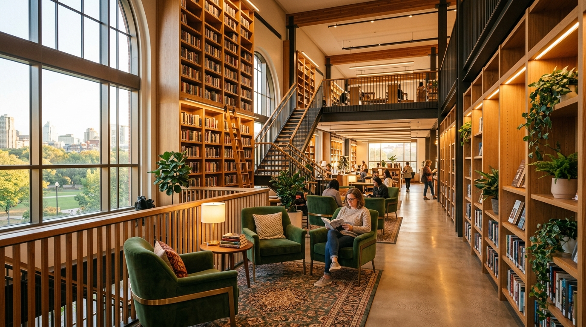

# 🌿 Greenwood Public Library

A minimal, modern, editorial-style landing page for **Greenwood Public Library** — built with **HTML** and **Tailwind CSS v4 (CLI)** only. Zero JavaScript.



---

## ✨ Features

### Sections (12 total)

| #  | Section              | Highlights                                                                 |
|----|----------------------|----------------------------------------------------------------------------|
| 1  | **Navigation**       | Sticky navbar, `backdrop-blur-md`, animated underline links, pill CTA      |
| 2  | **Hero**             | Large editorial typography, dual CTA buttons, hover-zoom image, stats row  |
| 3  | **Sections Grid**    | 2-column responsive grid, 6 cards with unique `hover:bg-*-50` color tints  |
| 4  | **Gallery**          | 2×2 image grid, `overflow-hidden` + `group-hover:scale-105` zoom effect   |
| 5  | **Values (Bento)**   | Asymmetrical bento grid with `col-span-2`, pastel card backgrounds         |
| 6  | **About**            | Newspaper-style `columns-2` text layout                                    |
| 7  | **Membership**       | 4-column cards with image headers, "Popular" badge, pricing tiers          |
| 8  | **Testimonial**      | `grayscale → hover:grayscale-0` avatar transition, blockquote              |
| 9  | **Contact CTA**      | Tinted `bg-emerald-50` block with address, hours, and action buttons       |
| 10 | **Events**           | 4-column blog-style grid with hover-zoom images                            |
| 11 | **Footer**           | Multi-column layout, social icons with hover effects, legal links          |
| 12 | **Animations**       | CSS-only `@keyframes` (fadeUp, fadeIn, scaleUp) with staggered delays      |

### Design Techniques

- Large, light-weight editorial typography
- Asymmetrical bento grid layouts
- Hover transformations (image zoom, grayscale transitions)
- CSS-only staggered entry animations via `@theme` + `@keyframes`
- Group hover effects (`group` / `group-hover`)
- Smooth transitions (`transition-all`, `transition-colors`, `transition-transform`)
- Pseudo-element animated underlines on nav links
- `max-w-7xl` constrained containers
- Responsive design (mobile → desktop)

---

## 🛠 Tech Stack

| Technology        | Version | Purpose                          |
|-------------------|---------|----------------------------------|
| HTML5             | —       | Semantic structure               |
| Tailwind CSS      | v4.3.3  | Utility-first styling            |
| @tailwindcss/cli  | v4.3.3  | CLI build tool (no bundler needed) |

> **No JavaScript.** No frameworks. No custom fonts. No external CSS libraries.

---

## 📁 Project Structure

```
greenwood-library/
├── index.html          # Main landing page (pure HTML)
├── input.css           # Tailwind source CSS (@import, @theme, @keyframes)
├── output.css          # Compiled CSS (generated by CLI — do not edit)
├── package.json        # npm scripts (build / dev)
├── hero.jpg            # Hero section image
├── gallery1.jpg        # Gallery — Reading Room
├── gallery2.jpg        # Gallery — Study Area
├── gallery3.jpg        # Gallery — Children's Section
├── gallery4.jpg        # Gallery — Library Café
├── member1.jpg         # Membership — Basic
├── member2.jpg         # Membership — Student
├── member3.jpg         # Membership — Family
├── avatar.jpg          # Testimonial avatar
├── event1.jpg          # Event — Book Club
├── event2.jpg          # Event — Writing Workshop
├── event3.jpg          # Event — Storytime
└── node_modules/       # Dependencies
```

---

## 🚀 Getting Started

### Prerequisites

- [Node.js](https://nodejs.org/) (v18 or later)
- npm (comes with Node.js)

### Installation

```bash
# Clone or download the project
cd greenwood-library

# Install dependencies
npm install
```

### Development

```bash
# Watch mode — auto-recompiles CSS on file changes
npm run dev
```

Then open `index.html` in your browser, or serve it locally:

```bash
# Optional: start a local server
python -m http.server 8080
# → Open http://localhost:8080
```

### Production Build

```bash
# One-time CSS build
npm run build
```

---

## 🎨 Customization

### Tailwind Configuration

All custom theme tokens are defined in [`input.css`](input.css) using Tailwind v4's **CSS-first configuration**:

```css
@import "tailwindcss";

@theme {
  --animate-fade-up:    fadeUp 0.8s ease-out both;
  --animate-fade-up-d1: fadeUp 0.8s 0.10s ease-out both;
  /* ... more animation tokens */
}

@keyframes fadeUp {
  0%   { opacity: 0; transform: translateY(32px); }
  100% { opacity: 1; transform: translateY(0); }
}
```

### Adding New Animations

1. Define a `@keyframes` block in `input.css`
2. Add an `--animate-*` token inside `@theme`
3. Use it in HTML as `class="animate-your-name"`
4. Run `npm run build` to recompile

### Changing Colors

All colors use Tailwind's default palette (`emerald`, `slate`, `amber`, `rose`, `violet`, `sky`, `teal`, `zinc`). To change a section's hover tint, update the `hover:bg-*` class on the corresponding card in `index.html`.

---

## 📐 Responsive Breakpoints

| Breakpoint | Width    | Layout Changes                          |
|------------|----------|-----------------------------------------|
| Default    | < 640px  | Single column, compact typography       |
| `sm:`      | ≥ 640px  | 2-column grids, text columns            |
| `md:`      | ≥ 768px  | Nav links visible, larger hero image    |
| `lg:`      | ≥ 1024px | 3–4 column grids, bento layout          |

---
 
 
